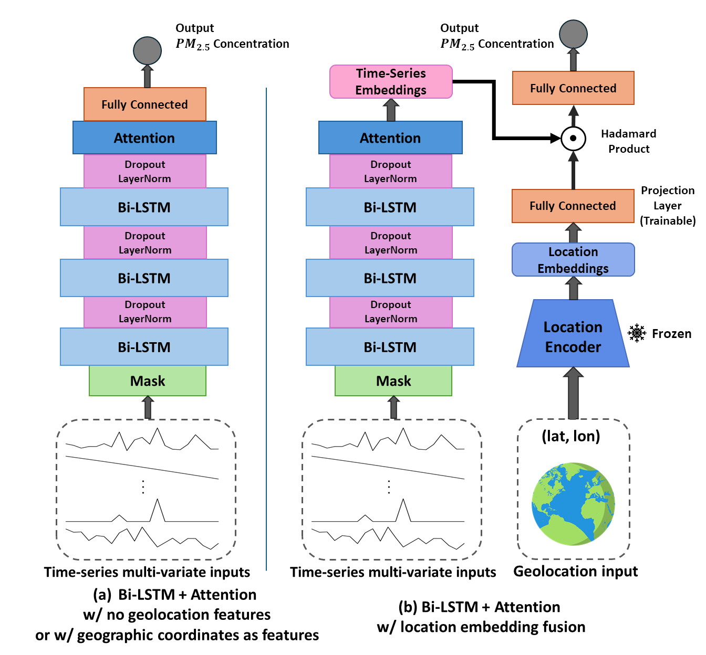

# Performance and Generalizability Impacts of Incorporating Geolocation into Deep Learning for Dynamic PM2.5 Estimation

> **Preprint:** [arXiv:2505.18461](https://arxiv.org/abs/2505.18461)    
> **Code base:** Fork/extension of [`geohai/PM2.5_CONUS_LSTM`](https://github.com/geohai/PM2.5_CONUS_LSTM)    
> **Authors:** Morteza Karimzadeh · Zhongying Wang · James L. Crooks    
> **Status:** *Under review*    
> **Last updated:** May 30 2025

---

## 1 · Project summary

This repository houses **all code** required to reproduce the experiments in the accompanying preprint. Building on the baseline Bi-LSTM architecture in *PM2.5_CONUS_LSTM*, we embed geolocation information through learned location encoders and show sizable gains in both accuracy and spatial generalizability.




### Key contributions
- **Location embeddings (GeoCLIP / SatCLIP)** – plug-and-play modules that transform latitude–longitude pairs into dense vectors using pretrained geospatial contrastive models.  
- **Unified training & inference script** – single entry-point for training, fine-tuning, and evaluation.  
- **Reproducibility** – deterministic seeds, conda environment file, and CI test workflow.  

---

## 2 · Location Encoders
| Encoder     | Paper & citation                                                                            | Code                                                                                       |
| ----------- | ------------------------------------------------------------------------------------------- | ------------------------------------------------------------------------------------------ |
| **GeoCLIP** | Vivanco *et al.* 2023 — *GeoCLIP: Clip-Inspired Alignment between Locations and Images for Effective Worldwide Geo-localization* | [GeoCLIP GitHub Repo](https://github.com/VicenteVivan/geo-clip)     |
| **SatCLIP** | Klemmer *et al.* 2025 — *SatCLIP: Global, General-Purpose Location Embeddings with Satellite Imagery*       | [SatCLIP GitHub Repo](https://github.com/microsoft/satclip) |

## 3 · Citation

```bibtex
@article{wang2025geolstm,
  author  = {Wang, Zhongying and Karimzadeh, Morteza and Crooks, James L.},
  title   = {Performance and Generalizability Impacts of Incorporating Geolocation into Deep Learning for Dynamic PM2.5 Estimation},
  journal = {arXiv preprint arXiv:2505.18461},
  year    = {2025}
}
```